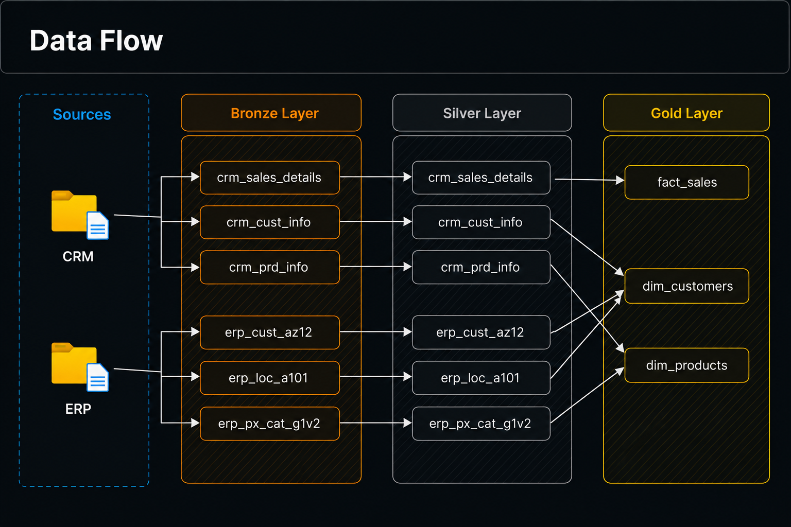
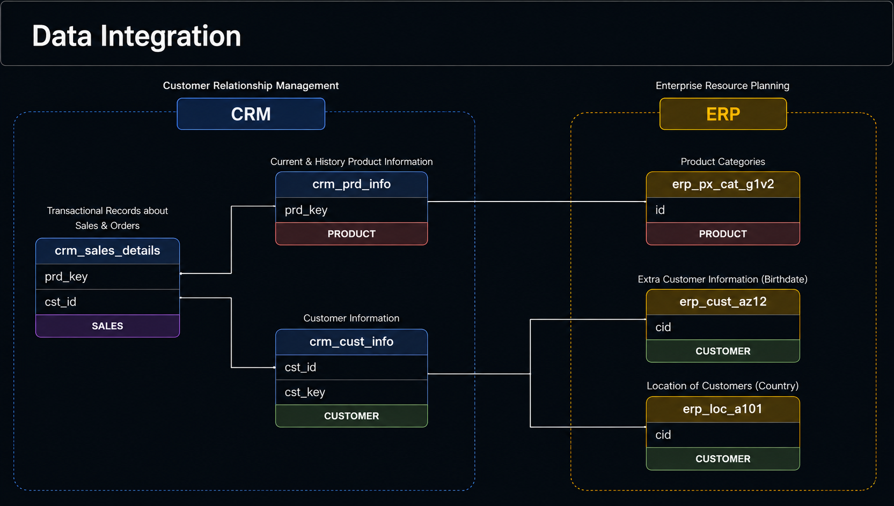
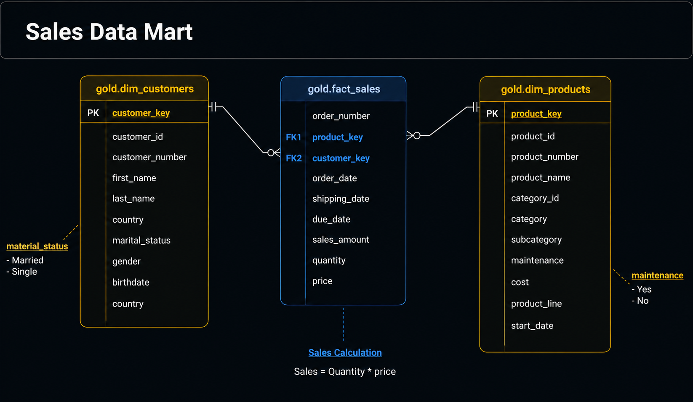

# 🏗️ Enterprise Data Warehouse Architecture

> A modern, layered data warehouse platform that integrates data from multiple enterprise sources, transforms it through controlled processing stages, and delivers business-ready datasets for analytics, reporting, ad-hoc SQL, and machine learning.

[](#)
[](#)
[](#)
[](#-license)

---

## 📖 Table of Contents

- [Overview](#-overview)
- [Architecture](#-architecture)
- [Data Flow](#-data-flow)
- [Data Integration](#-data-integration)
- [Medallion Layers](#-medallion-layers)
  - [Bronze Layer](#-bronze-layer)
  - [Silver Layer](#-silver-layer)
  - [Gold Layer](#-gold-layer)
- [Gold Data Model — Sales Data Mart](#-gold-data-model--sales-data-mart)
- [Consumption Layer](#-consumption-layer)
- [Data Quality](#️-data-quality)
- [Design Principles](#-design-principles)
- [Repository Structure](#-repository-structure)
- [Layer Responsibilities](#️-layer-responsibilities)
- [Example End-to-End Scenario](#-example-end-to-end-scenario)
- [Testing Strategy](#-testing-strategy)
- [Future Enhancements](#-future-enhancements)
- [Project Goals](#-project-goals)
- [License](#-license)

---

## 🔎 Overview

This project implements a **layered data warehouse** built on the industry-standard **Bronze → Silver → Gold (Medallion) architecture**. It ingests data from multiple enterprise systems, applies progressive cleansing and transformation, and produces a dimensional model ready for consumption by BI tools, analysts, and machine learning pipelines.

**Pipeline stages:**

```
COLLECT → INGEST → COMPUTE → STORE → CONSUME
```

| Stage | Responsibility |
|---|---|
| **Collect** | Identify and connect to upstream source systems (CRM, ERP, CSV files) |
| **Ingest** | Load raw source data into the warehouse using controlled batch strategies |
| **Compute** | Cleanse, standardize, normalize, and enrich data |
| **Store** | Persist data across Bronze, Silver, and Gold layers |
| **Consume** | Serve business-ready data to BI, SQL, and ML workloads |

---

## 🏛️ Architecture


The platform separates data collection, ingestion, transformation, storage, and consumption into distinct, independently scalable stages.

### Data Sources

| Source | Description | Data Type |
|---|---|---|
| **CRM** | Customer, sales, product, and interaction data | Structured |
| **ERP** | Enterprise operational, financial, product, and customer data | Structured |
| **CSV Files** | External or manually supplied flat-file datasets | Semi-structured / Flat files |

**CRM** provides: customers, customer interactions, sales, orders, products, and customer attributes (`crm_sales_details`, `crm_cust_info`, `crm_prd_info`).

**ERP** provides: customer information, product categories, customer locations, and operational data (`erp_cust_az12`, `erp_loc_a101`, `erp_px_cat_g1v2`).

### Ingestion Strategy

| Strategy | Description |
|---|---|
| **Batch Processing** | Data is processed on a schedule rather than streamed continuously |
| **Full Load** | Reloads the complete dataset — useful for small sources or when CDC isn't available |
| **Truncate & Insert** | `TRUNCATE` → Extract → Transform/Validate → `INSERT INTO` target |
| **Stored Procedures** | Encapsulate repeatable ETL logic: loading, transformation, validation, dependency management |

---

## 🔄 Data Flow



Source entities move through each layer with progressively richer structure — raw tables in **Bronze**, cleaned/standardized tables in **Silver**, and consolidated dimensional objects in **Gold**:

```
crm_sales_details ──┐
crm_cust_info ───────┼──► Bronze ──► Silver ──┐
crm_prd_info ────────┘                        ├──► fact_sales
                                               ├──► dim_customers
erp_cust_az12 ───────┐                        └──► dim_products
erp_loc_a101 ─────────┼──► Bronze ──► Silver ──┘
erp_px_cat_g1v2 ──────┘
```

---

## 🧩 Data Integration



Multiple source systems are joined on shared business keys to build unified analytical entities:

```
CRM Customer Info + ERP Customer Info + ERP Customer Location  →  Unified Customer Entity
CRM Product Info + ERP Product Category                        →  Unified Product Entity
CRM Sales Info + Customer Info + Product Info                  →  Sales Fact
```

| Entity | Key | Description |
|---|---|---|
| `crm_sales_details` | `prd_key`, `cst_id` | Transactional records of sales & orders |
| `crm_cust_info` | `cst_id`, `cst_key` | Customer master data |
| `crm_prd_info` | `prd_key` | Current & historical product information |
| `erp_cust_az12` | `cid` | Additional customer attributes (e.g. birthdate) |
| `erp_loc_a101` | `cid` | Customer location / country |
| `erp_px_cat_g1v2` | `id` | Product category reference data |

---

## 🥉🥈🥇 Medallion Layers

```
                 DATA WAREHOUSE
       ┌───────────────────────────────┐
       │   🥉 BRONZE — Raw Data        │
       └───────────────┬───────────────┘
                        ▼
       ┌───────────────────────────────┐
       │   🥈 SILVER — Cleaned Data    │
       └───────────────┬───────────────┘
                        ▼
       ┌───────────────────────────────┐
       │   🥇 GOLD — Business-Ready    │
       └───────────────────────────────┘
```

### 🥉 Bronze Layer

Stores raw source data with **no transformation**, preserving an auditable record of exactly what was ingested.

| | |
|---|---|
| **Object Type** | Tables |
| **Data State** | Raw / As-Is |
| **Transformations** | None |
| **Load Strategy** | Batch, Full Load, Truncate & Insert |

**Example tables:** `crm_sales_details`, `crm_cust_info`, `crm_prd_info`, `erp_cust_az12`, `erp_loc_a101`, `erp_px_cat_g1v2`

### 🥈 Silver Layer

The controlled transformation layer between raw and business-ready data.

| | |
|---|---|
| **Object Type** | Tables |
| **Data State** | Cleaned & Standardized |
| **Transformations** | Cleansing, Standardization, Normalization, Derived Columns, Enrichment |

**Pipeline:** `Bronze → Cleansing → Standardization → Normalization → Enrichment → Silver`

**Key transformation activities:**
- **Cleansing** — handle missing values, remove invalid records/duplicates, validate data types
- **Standardization** — consistent casing, date formats, categorical values (e.g. `"USA"`, `"United States"`, `"US"` → `"United States"`)
- **Normalization** — reduce redundancy and inconsistent relationships
- **Derived Columns** — e.g. `Quantity × Price → Sales Amount`
- **Enrichment** — combine CRM + ERP customer/location data into one dataset

### 🥇 Gold Layer

Business-ready datasets optimized for direct consumption.

| | |
|---|---|
| **Object Type** | Views / Business-Ready Tables |
| **Transformations** | Data Integration, Aggregations, Business Logic |
| **Supported Models** | Star Schema, Flat Tables, Aggregated Tables, Analytical Views |

---

## ⭐ Gold Data Model — Sales Data Mart



A **star schema** with one fact table surrounded by descriptive dimensions.

### 📊 Fact Table — `gold.fact_sales`

| Column | Description |
|---|---|
| `order_number` | Unique sales order identifier |
| `product_key` | FK → `dim_products` |
| `customer_key` | FK → `dim_customers` |
| `order_date` | Date the order was placed |
| `shipping_date` | Date the order was shipped |
| `due_date` | Expected delivery/due date |
| `sales_amount` | Sales value (`quantity × price`) |
| `quantity` | Quantity sold |
| `price` | Unit price |

### 👤 Dimension — `gold.dim_customers`

`customer_key`, `customer_id`, `customer_number`, `first_name`, `last_name`, `country`, `marital_status`, `gender`, `birthdate`

**Enables:** sales by customer/country, customer segmentation, demographics, behavior analysis.

### 📦 Dimension — `gold.dim_products`

`product_key`, `product_id`, `product_number`, `product_name`, `category_id`, `category`, `subcategory`, `maintenance`, `cost`, `product_line`, `start_date`

**Enables:** sales by product/category/subcategory, profitability, performance, lifecycle analysis.

---

## 📈 Consumption Layer

### BI & Reporting
Dashboards, KPIs, and business reports answering questions like:
- What are total sales?
- Which products generate the most revenue?
- Which countries generate the highest sales?
- Who are the highest-value customers?

### Ad-Hoc SQL Queries

```sql
SELECT
    c.country,
    SUM(f.sales_amount) AS total_sales
FROM gold.fact_sales AS f
JOIN gold.dim_customers AS c
    ON f.customer_key = c.customer_key
GROUP BY c.country
ORDER BY total_sales DESC;
```

### Machine Learning

`Gold Data → Feature Engineering → Training Dataset → Model → Predictions`

**Use cases:** customer segmentation, sales forecasting, churn prediction, product recommendation, demand prediction, customer lifetime value modeling.

---

## 🛡️ Data Quality

Quality is enforced at every stage of the pipeline, not just at the final layer.

| Dimension | Description |
|---|---|
| **Completeness** | Required fields are populated |
| **Accuracy** | Values represent valid business information |
| **Consistency** | Entities are represented consistently across systems |
| **Uniqueness** | No unintended duplicate records |
| **Validity** | Values conform to expected formats/business rules |
| **Referential Integrity** | Fact–dimension relationships are valid |

**Example checks:**

```sql
-- Duplicate detection
SELECT customer_id, COUNT(*) AS record_count
FROM silver.customer_data
GROUP BY customer_id
HAVING COUNT(*) > 1;

-- Null validation
SELECT * FROM silver.customer_data WHERE customer_id IS NULL;

-- Referential integrity
SELECT f.customer_key
FROM gold.fact_sales AS f
LEFT JOIN gold.dim_customers AS c ON f.customer_key = c.customer_key
WHERE c.customer_key IS NULL;
```

---

## 🔐 Design Principles

| Principle | Description |
|---|---|
| **Separation of Concerns** | Bronze → ingestion, Silver → transformation, Gold → business logic |
| **Traceability** | Raw data retained in Bronze so downstream data can always be traced back |
| **Reusability** | Silver datasets support multiple Gold use cases |
| **Scalability** | Each layer evolves independently as volume/requirements grow |
| **Maintainability** | Business logic separated from raw ingestion logic |
| **Consistency** | Centralized transformation logic avoids duplication across tools |

---

## 📁 Repository Structure

```
data-architecture/
│
├── README.md
│
├── docs/
│   ├── images/
│   │   ├── data_architecture.png
│   │   ├── data_flow.png
│   │   ├── data_integration.png
│   │   └── sales_data_mart.png
│   │
│   └── architecture/
│       ├── high-level-architecture.md
│       ├── data-flow.md
│       ├── data-integration.md
│       └── data-model.md
│
├── scripts/
│   ├── bronze/
│   │   ├── tables/
│   │   ├── stored_procedures/
│   │   └── loads/
│   ├── silver/
│   │   ├── tables/
│   │   ├── transformations/
│   │   └── stored_procedures/
│   └── gold/
│       ├── views/
│       ├── dimensions/
│       ├── facts/
│       └── aggregations/
│
│
├── data/
|   ├── source/
│   ├── source_crm/
│   │   ├── cust_info.csv
│   │   ├── prd_info.csv
│   │   └── sales_info.csv
│   │
│   ├── source_erp/
│   |   ├── CUST_AZ12.csv
│   |   ├── LOC_A101.csv
│   |   └── PX_CAT_G1V2.csv
│   │
│   ├── bronze/
│   │   ├── crm_cust_info.csv
│   │   ├── crm_prd_info.csv
│   │   ├── crm_sales_details.csv
│   │   ├── erp_cust_az12.csv
│   │   ├── erp_loc_a101.csv
│   │   └── erp_px_cat_g1v2.csv
│   │
│   ├── silver/
│   │   ├── crm_cust_info.csv
│   │   ├── crm_prd_info.csv
│   │   ├── crm_sales_info.csv
│   │   ├── erp_cust_az12.csv
│   │   ├── erp_loc_a101.csv
│   │   └── erp_px_cat_g1v2.csv
│   │
│   └── gold/
│       ├── dim_customers.csv
│       ├── dim_products.csv
│       └── fact_sales.csv
│
│
│
└── tests/
    ├── data_quality/
    ├── transformations/
    └── integration/
```

---

## 🗂️ Layer Responsibilities

| Layer | Primary Responsibility | Data State | Object Type |
|---|---|---|---|
| **Source** | Generate data | Operational | CRM / ERP / CSV |
| **Bronze** | Store raw data | Raw / As-Is | Tables |
| **Silver** | Clean and standardize | Transformed | Tables |
| **Gold** | Apply business logic | Business-ready | Views / Tables |
| **Consumption** | Analyze data | Analytical | BI / SQL / ML |

---

## 🔍 Example End-to-End Scenario

A sales transaction generated in the CRM flows through the pipeline as follows:

1. **Source** — CRM generates `crm_sales_details` (`order_number`, `product_id`, `customer_id`, `quantity`, `price`)
2. **Bronze** — Raw data is loaded with minimal transformation
3. **Silver** — Data is validated, cleansed, and standardized
4. **Integration** — Customer and product data is enriched from CRM + ERP
5. **Gold** — Business-ready objects are created: `gold.dim_customers`, `gold.dim_products`, `gold.fact_sales`
6. **Consumption** — Data is served to BI dashboards, SQL analysis, and ML pipelines

---

## 🧪 Testing Strategy

| Stage | Checks |
|---|---|
| **Source Validation** | File availability, schema compatibility, expected columns, data types, record counts |
| **Bronze Validation** | Record count, duplicates, null values, schema, load status |
| **Silver Validation** | Transformation rules, standardized values, data types, business rules, referential integrity |
| **Gold Validation** | Fact-dimension relationships, aggregations, business calculations, primary/foreign keys |

---

## 🚀 Future Enhancements

- **Incremental Loading** — replace/complement full loads with change-detection-based incremental processing
- **Change Data Capture (CDC)** — capture inserts, updates, and deletes directly from source systems
- **Orchestration** — introduce scheduling, dependency management, retries, and monitoring
- **Automated Data Quality Framework** — null checks, duplicate detection, referential integrity, schema drift, freshness
- **Pipeline Monitoring** — track status, volume, processing time, failure rate, freshness, and quality
- **Metadata & Catalog** — improve data discovery, ownership, lineage, and governance
- **Security** — role-based access control, data masking, encryption, audit logging, row-level security

---

## 🎯 Project Goals

- Integrate data from multiple enterprise sources
- Establish a reliable raw-data ingestion layer
- Clean and standardize source data
- Integrate CRM and ERP information into unified entities
- Apply centralized business logic
- Build business-ready analytical datasets
- Implement dimensional modeling (star schema)
- Provide a reliable foundation for BI and reporting
- Support ad-hoc analytical workloads
- Prepare structured datasets for machine learning

---

## 🧠 Architecture Summary

```
                         DATA SOURCES
               ┌──────────────┼──────────────┐
              CRM            ERP          CSV Files
               └──────────────┼──────────────┘
                               ▼
                        ┌─────────────┐
                        │  DATA LOAD  │
                        └──────┬──────┘
                               ▼
                        ┌─────────────┐
                        │   BRONZE    │  Raw
                        └──────┬──────┘
                               ▼
                        ┌─────────────┐
                        │ PROCESSING  │  Clean · Standardize · Normalize · Enrich
                        └──────┬──────┘
                               ▼
                        ┌─────────────┐
                        │   SILVER    │  Clean
                        └──────┬──────┘
                               ▼
                        ┌─────────────┐
                        │    GOLD     │  Business-Ready
                        └──────┬──────┘
               ┌──────────────┼──────────────┐
               ▼               ▼              ▼
              BI             SQL             ML
```

---

## 🏁 Conclusion

This project demonstrates a structured approach to building an analytical data platform using a layered data warehouse architecture. By separating ingestion, processing, storage, business logic, and consumption, it creates a reliable foundation for turning raw operational data into trusted, business-ready information — powering BI & Reporting, Ad-Hoc SQL, and Machine Learning from a single source of truth.

---

## 📜 License

This project is licensed under the [MIT License](LICENSE).

---

<p align="center">Built with a Bronze → Silver → Gold medallion architecture 🥉🥈🥇</p>
