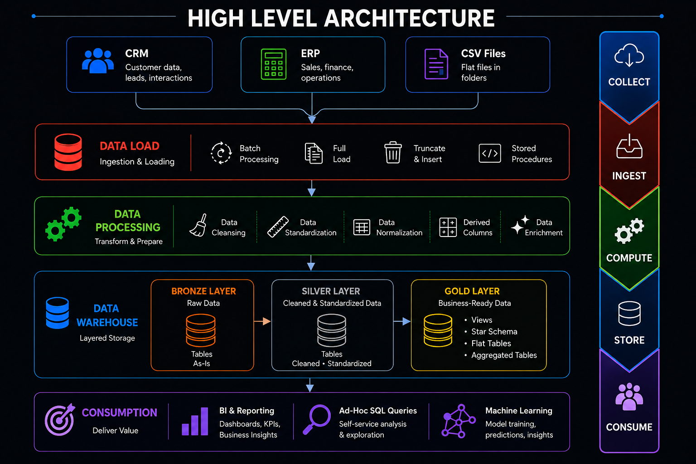

# High-Level Architecture

## Summary

The platform follows a **Collect → Ingest → Compute → Store → Consume**
pipeline built on a **Bronze → Silver → Gold** medallion data warehouse.

| Stage | Responsibility |
|---|---|
| Collect | CRM, ERP, and CSV source systems |
| Ingest | Data Load — batch processing, full load, truncate & insert, stored procedures |
| Compute | Data Processing — cleansing, standardization, normalization, derived columns, enrichment |
| Store | Data Warehouse — Bronze (raw), Silver (cleaned), Gold (business-ready) |
| Consume | BI & Reporting, Ad-Hoc SQL, Machine Learning |

See the main [README](../../README.md) for full details on each layer.
